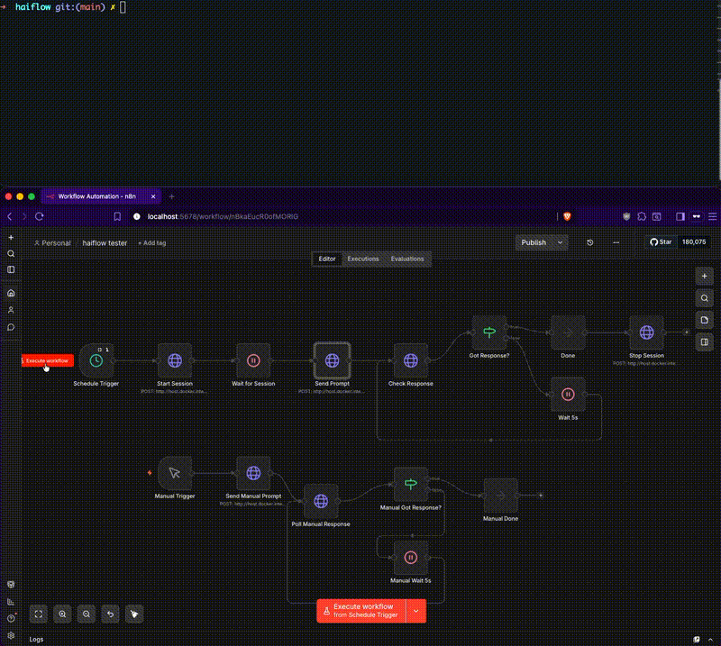

# haiflow

[](https://opensource.org/licenses/MIT)
[](https://bun.sh)
[](https://www.typescriptlang.org)
[](https://docs.anthropic.com/en/docs/claude-code)
[](https://n8n.io)
[](https://github.com/tmux/tmux)
[](https://github.com/andersonaguiar/haiflow)

Event-driven AI agent orchestrator. Trigger, queue, and manage headless [Claude Code](https://docs.anthropic.com/en/docs/claude-code) sessions over tmux via HTTP API. Built for n8n, webhooks, and automation workflows.



```
POST /trigger ──┐
                │         ┌──────────────┐
            ┌───▼────┐    │  tmux session │
            │ Queue  │───>│  (claude)     │
            │ (FIFO) │    └──────┬───────┘
            └────────┘           │
                          hooks fire on
                          session events
                                 │
                          ┌──────▼───────┐
                          │  Responses   │
                          └──────┬───────┘
GET /responses/:id <─────────────┘
```

## Prerequisites

- [Bun](https://bun.sh) v1.2.3+
- [tmux](https://github.com/tmux/tmux)
- [Claude Code CLI](https://docs.anthropic.com/en/docs/claude-code)
- [jq](https://jqlang.github.io/jq/)

## Quick start

```bash
git clone https://github.com/andersonaguiar/haiflow.git
cd haiflow
bun install      # also installs Claude Code hooks automatically
bun run dev      # starts server with hot reload
```

### Try it out

```bash
# Start a Claude session
curl -X POST http://localhost:3333/session/start \
  -H "Content-Type: application/json" \
  -d '{"session": "worker", "cwd": "/path/to/your/project"}'

# Send a prompt
curl -X POST http://localhost:3333/trigger \
  -H "Content-Type: application/json" \
  -d '{"prompt": "explain this codebase", "session": "worker", "id": "my-task"}'

# Poll for the response
curl -s "http://localhost:3333/responses/my-task?session=worker" | jq .

# Watch Claude work (read-only)
tmux attach -t worker -r

# Stop the session
curl -X POST http://localhost:3333/session/stop \
  -H "Content-Type: application/json" \
  -d '{"session": "worker"}'
```

Or use the CLI:

```bash
bun run bin/haiflow.ts start worker --cwd /path/to/your/project
bun run bin/haiflow.ts trigger "explain this codebase" --session worker
bun run bin/haiflow.ts status worker
bun run bin/haiflow.ts stop worker
```

## Setup

### 1. Install dependencies

```bash
bun install
```

### 2. Install hooks

Haiflow uses [Claude Code hooks](https://docs.anthropic.com/en/docs/claude-code/hooks) to track session state. The setup command merges hook config into `~/.claude/settings.json`:

```bash
bun run setup
```

The hooks are thin HTTP forwarders — they POST Claude Code events to the haiflow server. If the server isn't running, they silently no-op. They won't interfere with non-orchestrated Claude sessions (the server ignores unknown session IDs).

### 3. Configure environment (optional)

```bash
cp .env.example .env
```

| Variable | Default | Description |
|----------|---------|-------------|
| `PORT` | `3333` | HTTP server port |
| `HAIFLOW_DATA_DIR` | `/tmp/haiflow` | Directory for session state, queues, and responses |
| `HAIFLOW_PORT` | `3333` | Port used by hook scripts (set if different from PORT) |
| `N8N_API_KEY` | — | n8n API key for workflow integration |

## API

### `POST /session/start`

Start a Claude Code session in a detached tmux session.

```bash
curl -X POST http://localhost:3333/session/start \
  -H "Content-Type: application/json" \
  -d '{"session": "worker", "cwd": "/path/to/project"}'
```

| Field | Type | Required | Description |
|-------|------|----------|-------------|
| `cwd` | string | **Yes** | Working directory for Claude |
| `session` | string | No | Session name (default: `"default"`) |

### `POST /session/stop`

Kill a Claude tmux session.

```bash
curl -X POST http://localhost:3333/session/stop \
  -H "Content-Type: application/json" \
  -d '{"session": "worker"}'
```

### `POST /trigger`

Send a prompt to Claude. If Claude is busy, the prompt is auto-queued and sent when idle.

```bash
curl -X POST http://localhost:3333/trigger \
  -H "Content-Type: application/json" \
  -d '{"prompt": "summarize recent commits", "session": "worker", "id": "task-001"}'
```

| Field | Type | Required | Description |
|-------|------|----------|-------------|
| `prompt` | string | **Yes** | The prompt or slash command to send |
| `session` | string | No | Session name (default: `"default"`) |
| `id` | string | No | Custom task ID (auto-generated if omitted) |
| `source` | string | No | Label for where the trigger came from |

Responses:
- **Idle**: `{"id": "...", "sent": true}` — sent immediately
- **Busy**: `{"id": "...", "queued": true, "position": 1}` — auto-sends when idle
- **Offline**: `503` error

### `GET /responses/:id`

Get the response for a completed task.

```bash
curl -s "http://localhost:3333/responses/task-001?session=worker" | jq .
```

```json
{
  "id": "task-001",
  "completed_at": "2025-03-18T02:35:09Z",
  "messages": ["Here's a summary of recent commits..."]
}
```

Status codes:
- **200**: Complete — response body included
- **202**: `{"status": "pending"}` or `{"status": "queued"}`
- **404**: Unknown task ID

### `GET /status`

```bash
curl -s http://localhost:3333/status?session=worker | jq .
```

### `GET /sessions`

List all sessions and their status.

### `GET /responses`

List all completed response IDs.

### `GET /queue`

View queued prompts for a session.

### `DELETE /queue`

Clear all queued prompts.

### `GET /health`

Returns `ok`.

## How it works

1. **`POST /session/start`** spawns Claude in a detached tmux session with `--dangerously-skip-permissions`
2. **`POST /trigger`** sends prompts via `tmux send-keys` (or queues if busy) and assigns a task ID
3. **Claude Code hooks** forward lifecycle events (start, prompt, stop, end) to the haiflow server via HTTP
4. On task completion, the server extracts assistant messages from the session transcript and saves them keyed by task ID
5. **`GET /responses/:id`** returns the response once complete, or `pending`/`queued` status while in progress
6. The queue auto-drains — when Claude finishes one task, the next queued prompt is sent automatically

## Integration examples

### n8n

Import the workflow templates from `examples/n8n-workflows/`:
- `trigger-prompt.json` — Webhook that forwards prompts to haiflow
- `scheduled-trigger-with-polling.json` — Scheduled daily trigger with response polling

### Cron job

```bash
0 9 * * * curl -X POST http://localhost:3333/trigger \
  -H "Content-Type: application/json" \
  -d '{"prompt": "/daily-update", "id": "daily-'$(date +\%Y\%m\%d)'", "source": "cron"}'
```

### Shell alias

```bash
alias ct='curl -s -X POST http://localhost:3333/trigger -H "Content-Type: application/json" -d'
ct '{"prompt": "explain the error in the logs", "id": "debug-1"}'
```

## Project structure

```
haiflow/
├── src/
│   └── index.ts              # Bun HTTP server
├── tests/
│   ├── api.test.ts           # API integration tests
│   └── index.test.ts         # Unit tests
├── bin/
│   ├── haiflow.ts            # CLI wrapper
│   └── check-deps.sh         # Dependency checker
├── hooks/
│   ├── session-start.sh      # SessionStart hook
│   ├── prompt.sh             # UserPromptSubmit hook
│   ├── stop.sh               # Stop hook
│   └── session-end.sh        # SessionEnd hook
├── examples/
│   ├── n8n-workflows/        # Importable n8n workflow JSON files
│   └── curl-examples.sh      # Quick start curl scripts
├── .env.example
├── package.json
└── LICENSE
```

### Scripts

| Command | Description |
|---------|-------------|
| `bun run setup` | Install Claude Code hooks |
| `bun run dev` | Start server with hot reload |
| `bun run start` | Start server |
| `bun run check` | Check all dependencies |
| `bun test` | Run tests |

## License

MIT
